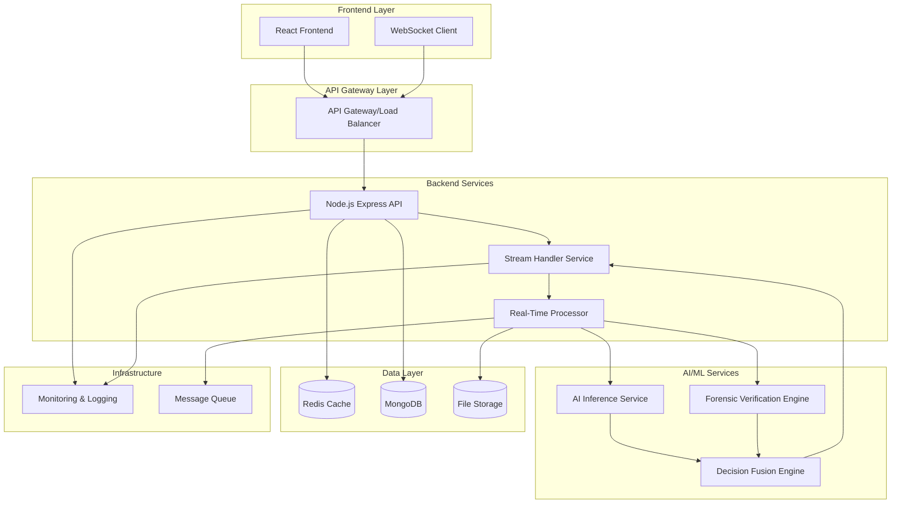

# Design Document: Real-Time Deepfake Video Detection System

## Overview

The Real-Time Deepfake Video Detection System is a production-grade, full-stack AI application that processes videos frame-by-frame in real time to detect deepfake content. The system combines pretrained CNN inference with forensic verification techniques, providing explainable results through a modern React interface backed by a scalable Node.js microservice architecture.

### Key Design Principles

- **Real-Time Processing**: Stream-based frame analysis with live feedback
- **Microservice Architecture**: Containerized, independently scalable components
- **AI as Service**: Pretrained model deployment without training requirements
- **Hybrid Detection**: Multi-modal verification combining AI and forensic analysis
- **Explainable AI**: Frame-wise confidence scores with visual anomaly highlighting
- **Production Ready**: Monitoring, logging, error handling, and deployment patterns

## Architecture

### System Architecture Diagram



### Component Responsibilities

**Frontend (React)**
- Real-time video upload interface with drag-and-drop
- Live processing visualization with frame-by-frame updates
- Interactive result dashboard with confidence scores
- Suspicious frame highlighting and anomaly annotations
- WebSocket connection for streaming updates

**Backend API (Node.js Express)**
- RESTful API endpoints for video operations
- WebSocket server for real-time communication
- Request validation and authentication
- Coordination between processing services
- Result aggregation and response formatting

**Stream Handler Service**
- Video upload and validation
- Frame extraction using FFmpeg
- Real-time frame streaming to processing pipeline
- Progress tracking and status updates
- Memory management for long videos

**Real-Time Processor**
- Frame-by-frame processing coordination
- Parallel processing of AI inference and forensic analysis
- Result aggregation and confidence calculation
- Performance optimization and resource management

**AI Inference Service**
- Pretrained CNN model deployment (containerized)
- Frame-level deepfake probability inference
- Batch processing optimization for throughput
- Model versioning and A/B testing support

**Forensic Verification Engine**
- Eye-blink pattern analysis
- Temporal consistency detection
- Compression artifact analysis
- Facial geometry verification
- Lighting and shadow consistency checks

**Decision Fusion Engine**
- Weighted combination of AI and forensic scores
- Confidence threshold management
- Explainability report generation
- Frame-wise anomaly ranking

## Components and Interfaces

### Frontend Components

**VideoUploadComponent**
```typescript
interface VideoUploadProps {
  onUpload: (file: File) => void;
  maxSize: number;
  acceptedFormats: string[];
}

interface UploadState {
  isUploading: boolean;
  progress: number;
  error?: string;
}
```

**RealTimeProcessingComponent**
```typescript
interface ProcessingState {
  currentFrame: number;
  totalFrames: number;
  processingSpeed: number;
  confidence: number;
  suspiciousFrames: number[];
  anomalies: AnomalyDetection[];
}

interface AnomalyDetection {
  frameNumber: number;
  type: 'eye_blink' | 'temporal' | 'compression' | 'geometry';
  confidence: number;
  region?: BoundingBox;
}
```

**ResultDashboardComponent**
```typescript
interface AnalysisResult {
  verdict: 'Real' | 'Fake';
  overallConfidence: number;
  processingTime: number;
  frameAnalysis: FrameResult[];
  forensicScore: number;
  aiScore: number;
  explanation: string[];
}

interface FrameResult {
  frameNumber: number;
  confidence: number;
  anomalies: AnomalyDetection[];
  thumbnail: string;
}
```

### Backend API Interfaces

**Video Processing API**
```typescript
// POST /api/videos/analyze
interface AnalyzeVideoRequest {
  video: File;
  options?: {
    realTime: boolean;
    sensitivity: 'low' | 'medium' | 'high';
    includeFrameAnalysis: boolean;
  };
}

interface AnalyzeVideoResponse {
  sessionId: string;
  status: 'processing' | 'completed' | 'failed';
  websocketUrl: string;
}

// WebSocket Events
interface ProcessingUpdate {
  type: 'frame_processed' | 'analysis_complete' | 'error';
  data: {
    frameNumber?: number;
    confidence?: number;
    anomalies?: AnomalyDetection[];
    result?: AnalysisResult;
    error?: string;
  };
}
```

**AI Inference Service API**
```typescript
// POST /inference/analyze-frame
interface FrameAnalysisRequest {
  frameData: Buffer;
  frameNumber: number;
  sessionId: string;
}

interface FrameAnalysisResponse {
  frameNumber: number;
  confidence: number;
  probability: {
    real: number;
    fake: number;
  };
  processingTime: number;
  modelVersion: string;
}
```

**Forensic Verification API**
```typescript
// POST /forensic/analyze-sequence
interface ForensicAnalysisRequest {
  frames: Buffer[];
  frameNumbers: number[];
  sessionId: string;
}

interface ForensicAnalysisResponse {
  sessionId: string;
  analyses: {
    eyeBlinkScore: number;
    temporalConsistencyScore: number;
    compressionArtifactScore: number;
    geometryConsistencyScore: number;
    lightingConsistencyScore: number;
  };
  anomalies: AnomalyDetection[];
  overallScore: number;
}
```

## Data Models

### Core Data Structures

**VideoSession**
```typescript
interface VideoSession {
  id: string;
  userId: string;
  filename: string;
  fileSize: number;
  duration: number;
  totalFrames: number;
  status: 'uploading' | 'processing' | 'completed' | 'failed';
  createdAt: Date;
  completedAt?: Date;
  result?: AnalysisResult;
}
```

**FrameAnalysis**
```typescript
interface FrameAnalysis {
  sessionId: string;
  frameNumber: number;
  aiConfidence: number;
  forensicScore: number;
  combinedScore: number;
  anomalies: AnomalyDetection[];
  processingTime: number;
  thumbnail: string;
  metadata: {
    resolution: { width: number; height: number };
    timestamp: number;
    fileSize: number;
  };
}
```

**SystemMetrics**
```typescript
interface SystemMetrics {
  timestamp: Date;
  processingSpeed: number; // frames per second
  queueLength: number;
  activeConnections: number;
  memoryUsage: number;
  cpuUsage: number;
  errorRate: number;
}
```

### Database Schema

**MongoDB Collections**

```javascript
// video_sessions collection
{
  _id: ObjectId,
  userId: String,
  filename: String,
  fileSize: Number,
  duration: Number,
  totalFrames: Number,
  status: String,
  createdAt: Date,
  completedAt: Date,
  result: {
    verdict: String,
    overallConfidence: Number,
    processingTime: Number,
    forensicScore: Number,
    aiScore: Number,
    explanation: [String]
  },
  metadata: {
    resolution: { width: Number, height: Number },
    codec: String,
    bitrate: Number
  }
}

// frame_analyses collection
{
  _id: ObjectId,
  sessionId: String,
  frameNumber: Number,
  aiConfidence: Number,
  forensicScore: Number,
  combinedScore: Number,
  anomalies: [{
    type: String,
    confidence: Number,
    region: {
      x: Number, y: Number,
      width: Number, height: Number
    }
  }],
  processingTime: Number,
  thumbnail: String,
  createdAt: Date
}
```

**Redis Cache Structure**

```javascript
// Session state cache
session:{sessionId} = {
  status: String,
  currentFrame: Number,
  totalFrames: Number,
  processingSpeed: Number,
  websocketConnections: [String]
}

// Frame processing queue
queue:frames = [
  {
    sessionId: String,
    frameNumber: Number,
    frameData: Buffer,
    priority: Number
  }
]

// Real-time metrics
metrics:current = {
  activeProcessing: Number,
  queueLength: Number,
  averageProcessingTime: Number,
  errorRate: Number
}
```

## Technical Implementation Details

### Real-Time Video Processing Pipeline

**Frame Extraction with FFmpeg**
```javascript
const ffmpeg = require('fluent-ffmpeg');

class FrameExtractor {
  async extractFrames(videoPath, sessionId) {
    return new Promise((resolve, reject) => {
      const frameStream = ffmpeg(videoPath)
        .outputOptions([
          '-vf', 'fps=30', // Extract at 30 FPS
          '-f', 'image2pipe',
          '-vcodec', 'png'
        ])
        .pipe();
      
      let frameNumber = 0;
      frameStream.on('data', (frameBuffer) => {
        this.processFrame(sessionId, frameNumber++, frameBuffer);
      });
      
      frameStream.on('end', resolve);
      frameStream.on('error', reject);
    });
  }
}
```

**WebSocket Streaming Implementation**
```javascript
class StreamHandler {
  constructor(io) {
    this.io = io;
    this.activeConnections = new Map();
  }
  
  handleConnection(socket) {
    socket.on('join_session', (sessionId) => {
      socket.join(sessionId);
      this.activeConnections.set(socket.id, sessionId);
    });
    
    socket.on('disconnect', () => {
      this.activeConnections.delete(socket.id);
    });
  }
  
  broadcastUpdate(sessionId, update) {
    this.io.to(sessionId).emit('processing_update', update);
  }
}
```

### AI Inference Service Architecture

**Model Deployment with Docker**
```dockerfile
FROM python:3.9-slim

# Install dependencies
RUN pip install torch torchvision opencv-python flask

# Copy pretrained model
COPY models/deepfake_detector.pth /app/models/

# Copy inference service
COPY inference_service.py /app/

WORKDIR /app
EXPOSE 5000

CMD ["python", "inference_service.py"]
```

**Inference Service Implementation**
```python
import torch
import cv2
import numpy as np
from flask import Flask, request, jsonify

class DeepfakeInferenceService:
    def __init__(self, model_path):
        self.model = torch.load(model_path)
        self.model.eval()
    
    def analyze_frame(self, frame_data):
        # Preprocess frame
        frame = cv2.imdecode(
            np.frombuffer(frame_data, np.uint8), 
            cv2.IMREAD_COLOR
        )
        frame = cv2.resize(frame, (224, 224))
        frame = torch.from_numpy(frame).float().unsqueeze(0)
        
        # Run inference
        with torch.no_grad():
            output = self.model(frame)
            probability = torch.softmax(output, dim=1)
            
        return {
            'confidence': float(probability[0][1]),  # Fake probability
            'real_prob': float(probability[0][0]),
            'fake_prob': float(probability[0][1])
        }

app = Flask(__name__)
service = DeepfakeInferenceService('/app/models/deepfake_detector.pth')

@app.route('/inference/analyze-frame', methods=['POST'])
def analyze_frame():
    frame_data = request.files['frame'].read()
    result = service.analyze_frame(frame_data)
    return jsonify(result)
```

### Forensic Verification Implementation

**Eye Blink Detection**
```javascript
class EyeBlinkDetector {
  constructor() {
    this.blinkHistory = [];
    this.normalBlinkRate = 15; // blinks per minute
  }
  
  analyzeBlinkPattern(frames) {
    const blinkEvents = [];
    
    for (let i = 0; i < frames.length; i++) {
      const eyeOpenness = this.detectEyeOpenness(frames[i]);
      
      if (eyeOpenness < 0.3 && i > 0) {
        const prevOpenness = this.detectEyeOpenness(frames[i-1]);
        if (prevOpenness > 0.7) {
          blinkEvents.push({
            frameNumber: i,
            duration: this.calculateBlinkDuration(frames, i)
          });
        }
      }
    }
    
    return this.calculateBlinkAnomalyScore(blinkEvents);
  }
  
  calculateBlinkAnomalyScore(blinkEvents) {
    const blinkRate = (blinkEvents.length / frames.length) * 30 * 60; // per minute
    const rateDifference = Math.abs(blinkRate - this.normalBlinkRate);
    
    return Math.min(rateDifference / this.normalBlinkRate, 1.0);
  }
}
```

**Temporal Consistency Analysis**
```javascript
class TemporalConsistencyAnalyzer {
  analyzeFrameSequence(frames) {
    const inconsistencies = [];
    
    for (let i = 1; i < frames.length; i++) {
      const opticalFlow = this.calculateOpticalFlow(frames[i-1], frames[i]);
      const facialLandmarks = this.extractFacialLandmarks(frames[i]);
      
      const motionConsistency = this.validateMotionConsistency(
        opticalFlow, 
        facialLandmarks
      );
      
      if (motionConsistency < 0.7) {
        inconsistencies.push({
          frameNumber: i,
          inconsistencyScore: 1 - motionConsistency,
          type: 'temporal_motion'
        });
      }
    }
    
    return this.calculateOverallInconsistencyScore(inconsistencies);
  }
}
```

### Decision Fusion Algorithm

**Weighted Score Combination**
```javascript
class DecisionFusionEngine {
  constructor() {
    this.weights = {
      ai_confidence: 0.6,
      eye_blink: 0.15,
      temporal_consistency: 0.15,
      compression_artifacts: 0.05,
      geometry_consistency: 0.05
    };
  }
  
  fuseScores(aiScore, forensicScores) {
    const weightedScore = 
      (aiScore * this.weights.ai_confidence) +
      (forensicScores.eyeBlink * this.weights.eye_blink) +
      (forensicScores.temporal * this.weights.temporal_consistency) +
      (forensicScores.compression * this.weights.compression_artifacts) +
      (forensicScores.geometry * this.weights.geometry_consistency);
    
    return {
      finalScore: weightedScore,
      verdict: weightedScore > 0.5 ? 'Fake' : 'Real',
      confidence: Math.abs(weightedScore - 0.5) * 2,
      contributingFactors: this.rankContributingFactors(aiScore, forensicScores)
    };
  }
  
  generateExplanation(scores, anomalies) {
    const explanations = [];
    
    if (scores.aiScore > 0.7) {
      explanations.push("AI model detected high probability of deepfake manipulation");
    }
    
    if (scores.forensicScores.eyeBlink > 0.6) {
      explanations.push("Abnormal eye blinking patterns detected");
    }
    
    if (scores.forensicScores.temporal > 0.6) {
      explanations.push("Temporal inconsistencies found between frames");
    }
    
    return explanations;
  }
}
```

## Correctness Properties

*A property is a characteristic or behavior that should hold true across all valid executions of a system—essentially, a formal statement about what the system should do. Properties serve as the bridge between human-readable specifications and machine-verifiable correctness guarantees.*

### Property Reflection

After analyzing all acceptance criteria, I identified several areas where properties can be consolidated:

- **Real-time processing properties** (1.1-1.6) can be combined into comprehensive streaming behavior properties
- **Service architecture properties** (2.1-2.6, 7.1-7.6) can be consolidated into microservice behavior properties  
- **Forensic analysis properties** (3.1-3.6) can be combined into comprehensive forensic verification properties
- **UI display properties** (5.2, 5.3, 5.6) can be consolidated into real-time visualization properties
- **Performance properties** (8.1-8.6) can be combined into comprehensive performance guarantees

### Core Properties

**Property 1: Real-Time Frame Processing**
*For any* uploaded video, when frame extraction begins, each frame should be processed sequentially and results should be streamed to the frontend immediately without waiting for complete video processing
**Validates: Requirements 1.1, 1.3, 1.5**

**Property 2: Live Processing Visualization**
*For any* video being processed, the frontend should display live updates including current frame number, progress, confidence scores, and suspicious frame detection as each frame is analyzed
**Validates: Requirements 1.2, 1.4, 1.6, 5.2, 5.3, 5.6**

**Property 3: AI Inference Service Independence**
*For any* video frame, the AI inference service should process it independently without training components, return results within milliseconds, and maintain consistent response structure regardless of frame content
**Validates: Requirements 2.1, 2.2, 2.4, 2.5**

**Property 4: Microservice Architecture Separation**
*For any* system component (Frontend, Backend, AI Service, Forensic Engine), it should operate independently, communicate only through defined APIs, and be containerized for independent deployment and scaling
**Validates: Requirements 2.3, 2.6, 7.1, 7.2, 7.4**

**Property 5: Comprehensive Forensic Analysis**
*For any* video sequence, the forensic verification engine should analyze eye-blink patterns, temporal consistency, compression artifacts, geometric consistency, and lighting consistency, returning weighted anomaly scores for each method
**Validates: Requirements 3.1, 3.2, 3.3, 3.4, 3.5, 3.6**

**Property 6: Decision Fusion and Explainability**
*For any* analysis result, the decision fusion engine should combine AI and forensic scores using weighted algorithms, generate frame-wise confidence scores, highlight anomalous regions, and provide ranked explanations of contributing factors
**Validates: Requirements 4.1, 4.2, 4.3, 4.5**

**Property 7: Comprehensive Result Output**
*For any* completed analysis, the system should return structured JSON containing frame-wise confidence scores, temporal trends, detailed forensic results, visual evidence, and reproducibility metadata
**Validates: Requirements 4.4, 4.6, 10.1, 10.2, 10.3, 10.4, 10.6**

**Property 8: API Communication and Coordination**
*For any* processing request, the backend should coordinate between AI and forensic services through API calls, handle WebSocket streaming, manage concurrent requests with queuing, and return comprehensive results
**Validates: Requirements 6.1, 6.2, 6.3, 6.5, 6.6**

**Property 9: Production-Grade Infrastructure**
*For any* system deployment, components should implement proper authentication, rate limiting, health checks, configuration management, structured logging with correlation IDs, and monitoring endpoints
**Validates: Requirements 6.4, 7.3, 7.5, 7.6, 9.1, 9.4**

**Property 10: Performance and Resilience**
*For any* processing workload, the system should maintain sub-100ms frame processing latency, consistent throughput, efficient memory management, circuit breaker patterns for service failures, and retry mechanisms with exponential backoff
**Validates: Requirements 8.1, 8.2, 8.5, 9.3, 9.5**

**Property 11: Error Handling and Diagnostics**
*For any* error condition, the system should provide appropriate HTTP status codes, detailed error categorization, diagnostic information while maintaining security, and adaptive behavior for varying network conditions
**Validates: Requirements 8.6, 9.2, 9.6**

**Property 12: Historical Data and Analytics**
*For any* analysis request, the system should provide API endpoints for querying historical results, batch processing statistics, and maintain data persistence for future analysis
**Validates: Requirements 10.5**

## Error Handling

### Error Categories and Responses

**Video Upload Errors**
- Invalid format: HTTP 400 with supported format list
- File size exceeded: HTTP 413 with size limits
- Corrupted file: HTTP 422 with validation details
- Network interruption: Automatic retry with exponential backoff

**Processing Errors**
- Frame extraction failure: Graceful degradation with partial results
- AI service unavailable: Circuit breaker activation, fallback to forensic-only analysis
- Memory exhaustion: Request queuing and resource cleanup
- Timeout errors: Partial result return with processing status

**Service Communication Errors**
- API endpoint failures: Retry with exponential backoff (max 3 attempts)
- WebSocket disconnection: Automatic reconnection with state recovery
- Authentication failures: HTTP 401 with refresh token guidance
- Rate limiting: HTTP 429 with retry-after headers

**Data Consistency Errors**
- Frame sequence gaps: Interpolation or gap marking in results
- Timestamp misalignment: Temporal correction algorithms
- Metadata corruption: Default value substitution with warnings

### Error Recovery Strategies

**Circuit Breaker Pattern**
```javascript
class CircuitBreaker {
  constructor(threshold = 5, timeout = 60000) {
    this.failureThreshold = threshold;
    this.timeout = timeout;
    this.failureCount = 0;
    this.state = 'CLOSED'; // CLOSED, OPEN, HALF_OPEN
    this.nextAttempt = Date.now();
  }
  
  async call(operation) {
    if (this.state === 'OPEN') {
      if (Date.now() < this.nextAttempt) {
        throw new Error('Circuit breaker is OPEN');
      }
      this.state = 'HALF_OPEN';
    }
    
    try {
      const result = await operation();
      this.onSuccess();
      return result;
    } catch (error) {
      this.onFailure();
      throw error;
    }
  }
}
```

**Graceful Degradation**
- AI service failure → Forensic-only analysis with reduced confidence
- Forensic service failure → AI-only analysis with warning
- Both services failure → Basic metadata analysis with error report
- Partial frame processing → Results with coverage percentage

## Testing Strategy

### Dual Testing Approach

The system requires both unit testing and property-based testing for comprehensive coverage:

**Unit Tests**: Focus on specific examples, edge cases, and integration points
**Property Tests**: Verify universal properties across all inputs through randomization

### Property-Based Testing Configuration

**Framework Selection**: 
- **Frontend (React)**: fast-check for JavaScript property testing
- **Backend (Node.js)**: fast-check for API and service testing  
- **AI Service (Python)**: Hypothesis for inference testing

**Test Configuration**:
- Minimum 100 iterations per property test
- Each property test tagged with: **Feature: deepfake-video-detector, Property {number}: {property_text}**
- Randomized input generation for videos, frames, and service responses

### Property Test Examples

**Property 1 Test: Real-Time Frame Processing**
```javascript
// Feature: deepfake-video-detector, Property 1: Real-Time Frame Processing
const fc = require('fast-check');

fc.assert(fc.property(
  fc.array(fc.uint8Array({ minLength: 1000, maxLength: 10000 }), { minLength: 10, maxLength: 100 }),
  async (frames) => {
    const processor = new RealTimeProcessor();
    const results = [];
    
    for (let i = 0; i < frames.length; i++) {
      const result = await processor.processFrame(frames[i], i);
      results.push(result);
      
      // Verify sequential processing
      expect(result.frameNumber).toBe(i);
      // Verify immediate streaming
      expect(result.timestamp).toBeLessThan(Date.now() + 100);
    }
    
    // Verify all frames processed in order
    expect(results.map(r => r.frameNumber)).toEqual([...Array(frames.length).keys()]);
  }
), { numRuns: 100 });
```

**Property 5 Test: Comprehensive Forensic Analysis**
```javascript
// Feature: deepfake-video-detector, Property 5: Comprehensive Forensic Analysis
fc.assert(fc.property(
  fc.array(fc.uint8Array({ minLength: 5000, maxLength: 15000 }), { minLength: 30, maxLength: 60 }),
  async (frameSequence) => {
    const forensicEngine = new ForensicVerificationEngine();
    const result = await forensicEngine.analyzeSequence(frameSequence);
    
    // Verify all analysis methods are performed
    expect(result.analyses).toHaveProperty('eyeBlinkScore');
    expect(result.analyses).toHaveProperty('temporalConsistencyScore');
    expect(result.analyses).toHaveProperty('compressionArtifactScore');
    expect(result.analyses).toHaveProperty('geometryConsistencyScore');
    expect(result.analyses).toHaveProperty('lightingConsistencyScore');
    
    // Verify weighted scoring
    expect(result.overallScore).toBeGreaterThanOrEqual(0);
    expect(result.overallScore).toBeLessThanOrEqual(1);
    
    // Verify anomaly detection
    expect(Array.isArray(result.anomalies)).toBe(true);
    result.anomalies.forEach(anomaly => {
      expect(['eye_blink', 'temporal', 'compression', 'geometry', 'lighting'])
        .toContain(anomaly.type);
    });
  }
), { numRuns: 100 });
```

### Unit Testing Focus Areas

**Integration Testing**:
- WebSocket connection handling and message streaming
- Service-to-service API communication
- Database operations and data persistence
- File upload and processing pipeline

**Edge Case Testing**:
- Empty or corrupted video files
- Network disconnection during processing
- Service failures and recovery
- Memory pressure scenarios
- Concurrent request handling

**Example Unit Tests**:
```javascript
describe('Video Upload Integration', () => {
  test('should handle corrupted video file gracefully', async () => {
    const corruptedFile = Buffer.from('invalid video data');
    const response = await request(app)
      .post('/api/videos/analyze')
      .attach('video', corruptedFile, 'test.mp4');
    
    expect(response.status).toBe(422);
    expect(response.body.error).toContain('corrupted');
  });
  
  test('should maintain WebSocket connection during long processing', async () => {
    const longVideo = generateTestVideo(300); // 5 minute video
    const socket = io('http://localhost:3000');
    const updates = [];
    
    socket.on('processing_update', (update) => updates.push(update));
    
    await uploadVideo(longVideo);
    await waitForProcessingComplete();
    
    expect(updates.length).toBeGreaterThan(100);
    expect(updates[updates.length - 1].type).toBe('analysis_complete');
  });
});
```

### Performance Testing

**Load Testing**:
- Concurrent video processing (10+ simultaneous uploads)
- Memory usage monitoring during long video processing
- WebSocket connection scaling (100+ concurrent connections)
- AI service throughput testing

**Latency Testing**:
- Frame processing time measurement (target: <100ms)
- End-to-end analysis time for various video lengths
- API response time monitoring
- WebSocket message delivery latency

### Security Testing

**Input Validation**:
- Malicious file upload attempts
- SQL injection in API parameters
- XSS prevention in frontend
- Authentication bypass attempts

**Service Security**:
- API rate limiting effectiveness
- Container isolation verification
- Secrets management validation
- Network security between services